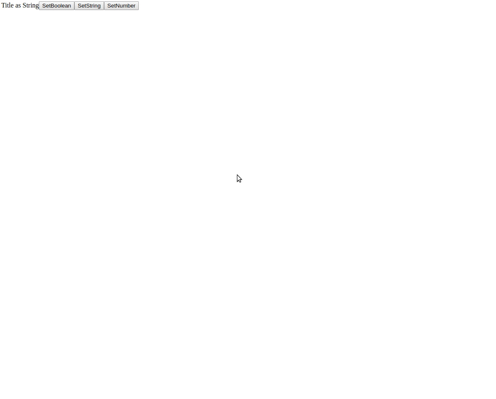

# react-props-monitor

[](https://www.npmjs.com/package/react-props-monitor)

In-depth review props in any React app.

## Install

```bash
yarn add -D react-props-monitor
```

or

```bash
npm install --save-dev react-props-monitor
```

## Usage

```javascript
import React from 'react';
import initPropsMonitor, { PropsMonitor } from 'react-props-monitor';

initPropsMonitor(React);

/../

render() {
  return (
    <div>
      <Root />
      <PropsMonitor />
    </div>
  );
}

```

> **ctrl+i** to open a monitor.



## Catch error of validation

### PropTypes

PropsMonitor displays exactly which props caused the error on based PropTypes of component.

### Custom validation function

You can define any validation function for props, based on prevProps, nextProps and name of component.

```javascript
const titleIsVerySmallNumber = ({ nextProps }) => {
  if (nextProps.title < 2000000)
    return 'Caution your title prop is small a number.';

  return false;
};

const titleShouldIncrease = ({ prevProps, nextProps, name }) => {
  if (name === 'TextBox' && prevProps && prevProps.title > nextProps.title)
    return 'Hey dude, I think you must to increase your title.';

  return false;
};

const validationFns = [
  titleIsVerySmallNumber,
  titleShouldIncrease,
];

/../

render() {
  return (
    <div>
      <Root />
      <PropsMonitor validation={validationFns} />
    </div>
  );
}

```

### Coming soon

- define and lock props
- forecast for types based on real props in runtime
